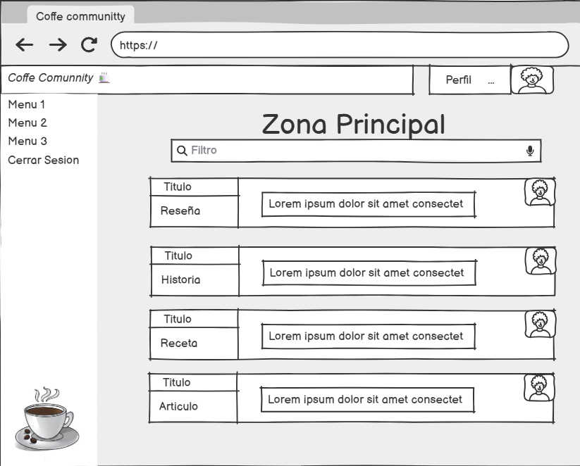

# Uso del Sistema

Este documento describe los roles principales de la plataforma y los casos de uso básicos previstos para el proyecto Coffee Community.

---

## Roles del sistema

### Usuario sin registrar
- Puede navegar por la plataforma.
- Puede leer blogs, reseñas y recetas.
- No puede publicar contenido.
- No dispone de perfil ni opciones de personalización.

### Usuario registrado
- Puede crear y editar su perfil.
- Puede publicar blogs, reseñas y recetas.
- Puede interactuar con otros usuarios (comentarios, valoraciones, etc.).
- Puede acceder a minijuegos y guardar progreso.

### Administrador
- Puede gestionar usuarios.
- Puede moderar contenido publicado.
- Puede editar o eliminar entradas inapropiadas.
- Tiene acceso a herramientas de control y supervisión.

---

## Casos de uso 

- Crear reseña  
- Publicar blog  
- Editar perfil  
- Comentar una entrada  
- Moderar contenido  
- Consultar recetas  
- Acceder a minijuegos  
- Ver perfiles de otros usuarios  

---

## Prototipo de la aplicación

A continuación se muestra una captura del prototipo inicial de la plataforma:

---

[Volver al inicio](index.md)
